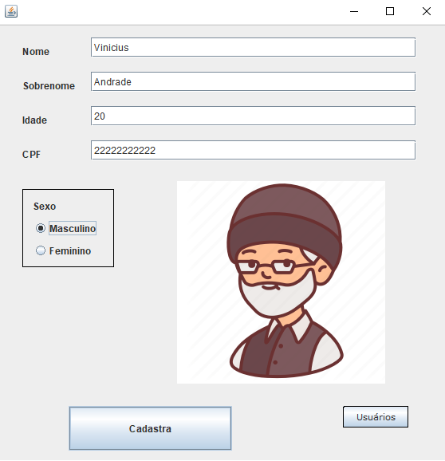
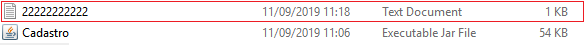
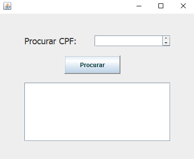

# Cadastro
An algorithm in Portuguese-BR developed in Java, using Graphical User Interface, that registers a user and saves the data in a text file

<h2> How it works </h2>

- First you have to complete all the filds with your information

- Then you click on "Cadastra" to save your information in a text file named with your CPF

- And if you want to search any registered user you should click on "Usuários" and type a valid CPF

